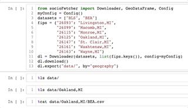
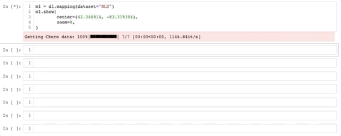

## socioFetcher

A tool built for simplifying socio-economic data downloading process, integrating python API wrappers of [BLS](https://www.bls.gov/), [BEA](https://www.bea.gov/), and [Census](https://www.census.gov/). The tool also allows users to mapping the data in an interactive map with [ipyleaflet](https://github.com/jupyter-widgets/ipyleaflet) in Jupyter notebook. 

### Demo

#### Download and export Raw data


#### Visualize it interactively in Jupyter notebook


## Installation
```
git clone https://github.com/tianxie1995/socio-fetcher.git
cd socio-fetcher
pip install . 
```

### Test
```
pytest -v
 ```

## Use example
Complete examples are located in [example folder](example)
### Download raw data
```
# Customize Config 
myConfig = Config()
myConfig.BLS.API_KEY = "YOUR_BLS_KEY"
myConfig.BLS.TABLE_NUMBER = ["ENU"]
myConfig.BLS.DATA_TYPE = ["1"]
myConfig.BLS.SIZE = ["0"]
myConfig.BLS.OWNERSHIP = ["5"]
myConfig.BLS.NAICS_CODE_LIST = {
            "10":	"10 Total, all industries",
            "101":	"101 Goods-producing",
            "102"	: "102 Service-providing"
        }

myConfig.BEA.API_KDY = "YOUR_BEA_KEY"
myConfig.BEA.LINE_CODE = ["3"]
myConfig.BEA.TABLE_NAME = ["CAINC1"]
myConfig.BEA.YEAR = ["ALL"]

datasets = ["BLS", "BEA"]
fips = {"26093": "Livingston,MI",
        "26099": "Macomb,MI",
        "26115": "Monroe,MI",
        "26125": "Oakland,MI",
        "26147": "St. Clair,MI",
        "26161": "Washtenaw,MI",
        "26163": "Wayne,MI"}
dl = Downloader(datasets, list(fips.keys()), config=myConfig)
dl.download()
dl.export("data/")
```
### Download summary by geography & dataset
```
# Customize Config 
myConfig = Config()
...
...

datasets = ["BLS", "BEA"]
fips = {"26093": "Livingston,MI",
        "26099": "Macomb,MI",
        "26115": "Monroe,MI",
        "26125": "Oakland,MI",
        "26147": "St. Clair,MI",
        "26161": "Washtenaw,MI",
        "26163": "Wayne,MI"}
dl = Downloader(datasets, list(fips.keys()), config=myConfig)
dl.download()
# export summary by geography
dl.export("summary/", summarize=True, by="geography")
# export summary by dataset
dl.export("summary/", summarize=True, by="dataset")
```

### Visualization with Jupyter notebook
```
# Customize Config 
myConfig = Config()
...
...

datasets = ["BLS", "BEA"]
fips = {"26093": "Livingston,MI",
        "26099": "Macomb,MI",
        "26115": "Monroe,MI",
        "26125": "Oakland,MI",
        "26147": "St. Clair,MI",
        "26161": "Washtenaw,MI",
        "26163": "Wayne,MI"}
dl = Downloader(datasets, list(fips.keys()), config=myConfig)
dl.download()
mapView = dl.mapping("BLS")
mapView.show(
        center=(42.346814, -83.319304), # specify map center
        zoom=8, # specify map zoom level 
        **kwargs # other map attributes available at https://ipyleaflet.readthedocs.io/en/latest/api_reference/map.html
)
```

## Report bugs and contribute to this tool
Please use [Github Issues]() to report bugs and contribute to this tool. 


## License 
This tool is licensed under [BSD License](LICENSE), see LICENSE for more detail. 
